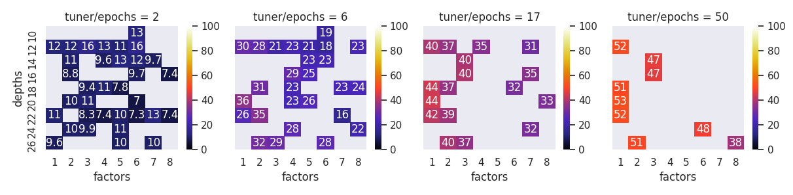

# Technical documentation

Before training, you need a dataset. If you're working with a research dataset supported by [TFDS](https://www.tensorflow.org/datasets/catalog/overview#image_classification) then you can skip the first part, else you need to
convert your dataset to TFRecord format.

### Converting the dataset to TFRecord format

go to `script` directory and use the `tfrecord_writer.py` script. To get a full list of parameters for this script run `python tfrecord_writer.py --help`.

The parameters you need to provide are :

- `tfrecord_dir_path`: directory where to store tfrecords
- `name`: name of the dataset
- `data.images_dir_path`: directory path for the images

Default behavior is to save the images in the tfrecord without any processing.
If you want to add some processing you can :
- crop the biggest possible square in the middle of the image and then scale to a fix size
- add a margin to transform the image to a square and the scale it to a fix size

To do this, set the `processing` parameter to "CENTER_CROP_THEN_SCALE" or "SQUARE_MARGIN_THEN_SCALE" and the `image_size` parameter to desired fix size.

Last thing to define is how to split the dataset. You may want to only create a training or validation set, but you also
may need to split the images into different sets in a well balanced fashion. This can be achived using the `data.split_name` and 
`data.split_percentages` parameters. By default `data.split_name` is a list of 3 elements : `['train', 'validation', 'test']` and
`data.split_percentages` a list of 3 floats: `[0.8, 0.1, 0.1]`, so 80% of the images will go into the train set, and 10% in validation and test. You can chose as many split you want.

For example, this command prepare a dataset by center cropping then scaling to 256x256, with 70% in training set and 30% in validation :

```bash
python3 tfrecord_writer.py \
  --tfrecord_dir_path /path/to/tfrecord
  --name example_dataset
  --preprocessing CENTER_CROP_THEN_SCALE
  --image_size 256 256
  --data.images_dir_path /path/to/image
  --data.split_names train validation
  --data.split_percentages 0.7 0.3
```

### Start the training

At this step, you should have a tfrecord ready for training. Now, let's go in details in the configuration of the training.

#### Setup the Engine

This code support training with Tensorflow 2.3 and UpStride 1.0. To select the framework use the `framework` parameter. Possible values are :

- tensorflow: well, you probably know this one
- upstride_real: should be used when working with the same mathematics than Tensorflow
- upstride_type1: should be used to deal with 2D data like points, lines, polygons or grayscale images.
- upstride_type2: should be used to deal with simple 3D data like 3D point cloud, 3D lines, polyhedrons or colored images
- upstride_type3: should be used to deal with more complex 3D data like 3D point cloud, 3D lines, polyhedrons or colored images

Please note that when using upstride engine, we highly recommend to reduce the number of channels in the neural network. This can be done using the `factor` parameter. 
Factor is the division factor to scale the number of channel. factor=2 means the model will have half the number of channels compare to default implementation

When using upstride_type2, we recommend to use factor=2 or factor=4.

Of course, if you're working with TensorFlow but with a small dataset, you may also want to change the factor

#### Setup the neural network

currently we support :

- `AlexNet`
- EfficientNet family, from `EfficientNetB0` to `EfficientNetB7`
- Resnet family: `ResNet18`, `ResNet34`, `ResNet50`, `ResNet101`, `ResNet152`, `ResNet20CIFAR`, `ResNet32CIFAR`, `ResNet44CIFAR`, `ResNet56CIFAR`, `ResNet18NCHW`, `ResNet34NCHW`, `ResNet50NCHW`, `ResNet101NCHW`, `ResNet152NCHW`
- MobileNet family: `MobileNetV2`, `MobileNetV2NCHW`
- NasNet family:`NASNetCIFAR`, `NASNetLarge`, `NASNetMobile`,
- `SqueezeNet`
- `TinyDarknet`
- `VGG16`

(of course this list will increase as time goes on)

you can select the model you want to train using the `model_name` parameter. Then you may want to tune the size of the input of the network (parameter `input_size`, by default 224x224x3)
and the size of the output of the neural network (parameter `num_classes`)


#### Setup the dataloader and preprocessing

First we need to give the training script the path to the tfrecord files. If you're working with a research dataset, the name of the dataset is enough, the code will download it automatically. For instance for working with
cifar10, `dataloader.name` can be set to `cifar10`.
For custom datasets, you need to provide the name and the path of the tfrecord file (parameter `dataloader.data_dir`)

Now we need to setup the data augmentation. The operations we support are :

- CentralCrop
- ColorJitter
- Normalize
- RandomHorizontalFlip
- RandomRotate
- RandomRotate90
- RandomVerticalFlip
- RandomCrop
- RandomCropThenResize
- Resize
- ResizeThenRandomCrop
- Translate

Using the parameters `dataloader.train_list` and `dataloader.val_list` you can list the data augmentation operations to run in the data pipeline. Operation will be executed in the order of the list.
Each of these operations have special parameters. Please check the output of `python3 train.py --help` for more details.

#### Setup the optimizer

Last this to setup in the training pipeline is of course the optimizer. Currently we support :

- adadelta
- adagrad
- adam
- adam_amsgrad
- sgd
- sgd_momentum
- sgd_nesterov
- nadam
- rmsprop

you can select the one you want using parameter `optimizer.name`. You may also want to tune the momentum of the optimizer using `optimizer.momentum` parameter

the initial learning rate can be selected using `optimizer.lr`. We also support a list of learning rate decay strategies:

- exponential_decay
- step_decay
- step_decay_schedule
- polynomial_decay
- inverse_time_decay
- cosine_decay
- lr_reduce_on_plateau

you can chose to turn on the learning rate decay strategy using option `optimizer.lr_decay_strategy.activate` and then select the one you prefer using `optimizer.lr_decay_strategy.lr_params.strategy` (default is lr_reduce_on_plateau).
There is a list of parameters to setup for everyone of these learning rate decay, please see `python3 train.py --help` or file `submodules/global_dl/training/optimizers.py` for more details.

#### Other parameters

Now, most of the work is done. The only remaining options are:
- `num_epochs` The number of epochs to run
- `checkpoint_dir`, `export_dir`, `log_dir`: paths to write checkpoints, exported model and training logs
- `configuration.with_mixed_precision`, `configuration.mirrored` , `configuration.profiler`, configuration for mixed precision training, mirrored strategy and tensorboard profiler


#### training example

to train a mobilenet for 20 epochs on cifar10, a training command can looks like this:

```bash
python train.py \
  --model.name MobileNetV2 \
  --model.num_classes 10 \
  --model.input_size 32 32 3 \
  --num_epochs 20 \
  --checkpoint_dir /tmp/checkpoint \
  --log_dir /tmp/log \
  --export.dir /tmp \
  --dataloader.name cifar10 \
  --dataloader.train_list RandomHorizontalFlip Normalize \
  --dataloader.val_list Normalize \
  --dataloader.val_split_id validation \
  --dataloader.train_split_id train \
  --dataloader.batch_size 64 \
  --optimizer.lr 0.0001
```

## More regarding the parameters

When training a neural network, you can use a bash command, but it is also possible to use a yaml file. For instance, the previous example can also be run with the command :

```bash
python train.py --yaml_config conf.yml
```

and the file `conf.yml`:

```yaml
model:
  name: MobileNetV2
  num_classes: 10
  input_size: [32, 32, 3]
num_epochs: 20
checkpoint_dir: /tmp/checkpoint
log_dir: /tmp/log
export:
  dir: /tmp
dataloader:
  name: cifar10
  train_list: [RandomHorizontalFlip, Normalize]
  val_list: [Normalize]
  val_split_id: validation
  train_split_id: train
  batch_size: 64
optimizer:
  lr: 0.0001
```

you can also mix both training file and command line. If a parameter is defined in both, then the command line will prevail.
For more information on the argument parser, please visit https://github.com/UpStride/betterargparse


## Keras-Tuner

Is is also possible to perform hyper-parameter tuning using Keras-Tuner and Hyperband algorithm. The 2 default exploration axis are 

  - depths : number of blocks in the network 
  - factor : divide ratio for the number of channels

Please note that Keras-Tuner only work with Mobilenet and Resnet for now.

The final results will look like this (figures are validation accuracy percentages):


